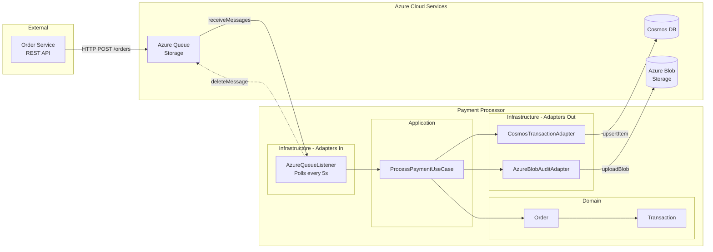

# Payment Processor

Microservice that consumes orders from Azure Queue Storage, saves transactions to Cosmos DB, and generates audit files in Azure Blob Storage.

## Architecture

- **Hexagonal Architecture** (ports and adapters)
- **Spring WebFlux** (reactive, non-blocking)
- **Java 17**
- **Maven**

### Architecture Diagram



### Flow

1. **Order Service** sends orders via REST API to **Azure Queue Storage**
2. **AzureQueueListener** polls the queue every 5 seconds and receives messages
3. **ProcessPaymentUseCase** processes the order and converts it to a Transaction
4. **CosmosTransactionAdapter** saves the transaction to **Cosmos DB**
5. **AzureBlobAuditAdapter** uploads a JSON audit file to **Blob Storage**
6. The message is deleted from the queue after successful processing

## Prerequisites

- Java 17
- Maven
- Docker Desktop
- [Azure Storage Explorer](https://azure.microsoft.com/es-es/products/storage/storage-explorer) (to visualize data in Queue and Blob)

## Related Microservice

- **Order Service**: [https://github.com/ismaelnv/Order-Service](https://github.com/ismaelnv/Order-Service)

## Environment Setup

### 1. Start emulators with Docker

Create a `docker-compose.yaml` file with the following content:

```yaml
services:
  azurite:
    container_name: azurite-emulator
    image: mcr.microsoft.com/azure-storage/azurite
    command: azurite -l /data --blobHost 0.0.0.0 --queueHost 0.0.0.0 --tableHost 0.0.0.0
    ports:
      - "10000:10000"
      - "10001:10001"
      - "10002:10002"
    volumes:
      - azurite-data:/data
  cosmosdb-emulator:
    image: mcr.microsoft.com/cosmosdb/linux/azure-cosmos-emulator
    container_name: cosmosdb-emulator
    environment:
      - AZURE_COSMOS_EMULATOR_PARTITION_COUNT=10
      - AZURE_COSMOS_EMULATOR_ENABLE_DATA_PERSISTENCE=true
      - AZURE_COSMOS_EMULATOR_IP_ADDRESS_OVERRIDE=127.0.0.1
    ports:
      - "8081:8081"
      - "10251:10251"
      - "10252:10252"
      - "10253:10253"
      - "10254:10254"
    volumes:
      - cosmosdb-data:/data
    tty: true
    stdin_open: true

volumes:
  azurite-data:
  cosmosdb-data:
```

Run:

```bash
docker-compose up -d
```

This starts:
- **Azurite** (Azure Storage emulator) → ports 10000, 10001, 10002
- **Cosmos DB Emulator** → port 8081

Verify they are running:

```bash
docker ps
```

### 2. Install SSL certificate for Cosmos DB

The Cosmos DB emulator uses HTTPS with a self-signed certificate. Java needs to trust it.

**Download the certificate:**

Open in the browser and save as `emulator.crt`:

```
https://localhost:8081/_explorer/emulator.pem
```

**Install in the JDK (run as administrator):**

```bash
keytool -import -trustcacerts -keystore "YOUR_JDK_17_PATH\lib\security\cacerts" -storepass "changeit" -noprompt -alias cosmodb -file "YOUR_CRT_PATH\emulator.crt"
```

Example:

```bash
keytool -import -trustcacerts -keystore "C:\Program Files\Amazon Corretto\jdk17.0.18_9\lib\security\cacerts" -storepass "changeit" -noprompt -alias cosmodb -file "C:\Users\your-user\Desktop\emulator.crt"
```

### 3. Configure Azure Storage Explorer

1. Open Azure Storage Explorer
2. Connect to → Storage account or service → Connection string
3. Paste the connection string:

```
DefaultEndpointsProtocol=http;AccountName=devstoreaccount1;AccountKey=Eby8vdM02xNOcqFlqUwJPLlmEtlCDXJ1OUzFT50uSRZ6IFsuFq2UVErCz4I6tq/K1SZFPTOtr/KBHBeksoGMGw==;BlobEndpoint=http://127.0.0.1:10000/devstoreaccount1;QueueEndpoint=http://127.0.0.1:10001/devstoreaccount1;TableEndpoint=http://127.0.0.1:10002/devstoreaccount1;
```

There you can visualize the queues and audit files in Blob Storage.

### 4. View data in Cosmos DB

Open in the browser:

```
https://localhost:8081/_explorer/index.html
```

There you can see the `payment-db` database, the `transactions` container, and the stored documents.

## Build and Run

```bash
# Build
mvnw.cmd clean install

# Run
mvnw.cmd spring-boot:run
```

The application runs on port **8082**.

## Run Tests

```bash
mvnw.cmd test
```

## Technologies

| Technology | Usage |
|---|---|
| Java 17 | Language |
| Spring Boot 4.0.3 | Framework |
| Spring WebFlux | Reactive endpoints |
| Azure Storage Queue | Message queue |
| Azure Blob Storage | Audit files (JSON) |
| Azure Cosmos DB (SQL API) | NoSQL database |
| Azurite | Local Azure Storage emulator |
| Cosmos DB Emulator | Local Cosmos DB emulator |
| Lombok | Boilerplate reduction |
| JUnit 5 + Mockito | Unit tests |
| Docker | Emulator containers |

## Project Structure

```
src/main/java/com/payment/processor/
├── PaymentProcessorApplication.java
├── payment/
│   ├── domain/
│   │   ├── model/
│   │   │   ├── Order.java
│   │   │   ├── OrderItem.java
│   │   │   └── Transaction.java
│   │   └── port/
│   │       ├── in/
│   │       │   └── ProcessPaymentUseCase.java
│   │       └── out/
│   │           ├── TransactionRepositoryPort.java
│   │           └── AuditStoragePort.java
│   ├── application/
│   │   └── usecase/
│   │       └── ProcessPaymentUseCaseImpl.java
│   └── infrastructure/
│       ├── adapter/
│       │   ├── in/queue/
│       │   │   └── AzureQueueListener.java
│       │   └── out/
│       │       ├── cosmos/
│       │       │   └── CosmosTransactionAdapter.java
│       │       └── blob/
│       │           └── AzureBlobAuditAdapter.java
│       └── config/
│           ├── AzureQueueConfig.java
│           ├── AzureBlobConfig.java
│           ├── CosmosDbConfig.java
│           └── JacksonConfig.java
k8s/
├── deployment.yaml
├── service.yaml
└── configmap.yaml
Dockerfile
```
